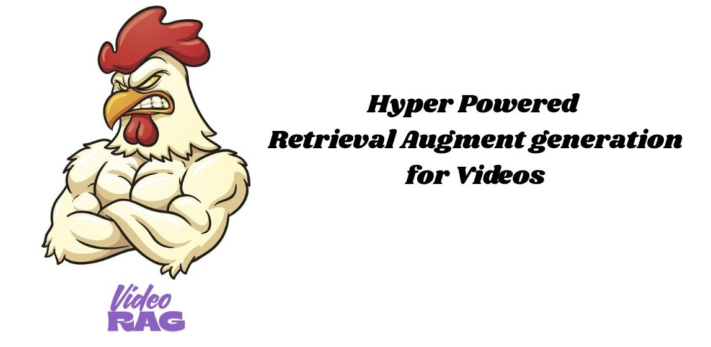
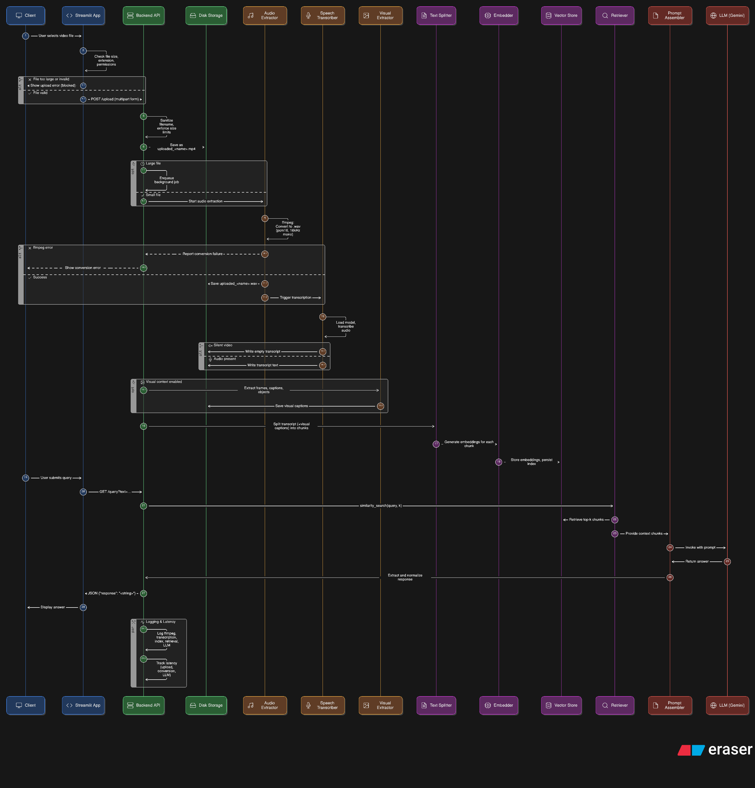

# 🎥 Video RAG
### Local Retrieval-Augmented Generation for Video Q&A
A simple Video RAG system that lets users upload a video, builds a local searchable index from the video's transcript (and optional visual captions), and answers user questions using Google Gemini (via langchain_google_genai). The pipeline is designed to be free/local where possible (Whisper for local transcription, HuggingFace sentence-transformers for embeddings, Chroma for vector store). Gemini is used as the LLM backend (requires Google credentials if you want real Gemini responses).




[](https://python.org)
[](https://streamlit.io)
[](https://fastapi.tiangolo.com)
[](LICENSE)



---

## ✨ Features

- 🎬 **Video Upload & Processing** - Support for MP4/MOV files with automatic audio extraction
- 🎙️ **Local Transcription** - Uses OpenAI Whisper for accurate, free speech-to-text
- 🔍 **Semantic Search** - HuggingFace embeddings with Chroma vector database
- 🤖 **AI-Powered Q&A** - Google Gemini integration for intelligent responses
- 🚀 **Real-time Interface** - Clean Streamlit frontend with FastAPI backend
- 💰 **Cost-Effective** - Local processing minimizes API costs

---

## 🏗️ Architecture

The system follows a clean pipeline architecture:

1. **Upload** → Video file received via Streamlit UI
2. **Extract** → FFmpeg converts video to audio (WAV)
3. **Transcribe** → Whisper generates text transcript locally
4. **Index** → Text chunked and embedded using sentence-transformers
5. **Store** → Chroma vector database for fast retrieval
6. **Query** → User questions matched against relevant chunks
7. **Generate** → Gemini produces contextual answers

---

## 📁 Project Structure

```
video-rag/
├── 📄 app.py              # Streamlit frontend interface
├── 🚀 backend.py          # FastAPI backend server
├── ⚙️ functions.py        # Core processing pipeline
├── 📦 requirements.txt    # Python dependencies
├── 🔐 .env               # Environment configuration
├── 📊 diagram-export-*    # Architecture diagram
└── 📖 README.md          # This file
```

---

## 🚀 Quick Start

### Prerequisites

- **Python 3.10+** (recommended: use virtual environment)
- **FFmpeg** installed and available in PATH
- **Google Cloud credentials** (optional, for Gemini responses)

### Installation

1. **Clone the repository**
   ```bash
   git clone <repository-url>
   cd video-rag
   ```

2. **Create virtual environment**
   ```bash
   python -m venv venv
   
   # Windows
   .\venv\Scripts\activate
   
   # macOS/Linux  
   source venv/bin/activate
   ```

3. **Install dependencies**
   ```bash
   pip install -r requirements.txt
   ```

4. **Install FFmpeg**
   
   **Windows:**
   ```bash
   # Using Chocolatey
   choco install ffmpeg -y
   
   # Using winget
   winget install --id=Gyan.FFmpeg -e
   ```
   
   **macOS:**
   ```bash
   brew install ffmpeg
   ```
   
   **Linux:**
   ```bash
   sudo apt update && sudo apt install ffmpeg
   ```

5. **Verify installation**
   ```bash
   ffmpeg --version
   ```

### Configuration

Create a `.env` file in the project root:

```env
# Optional: Whisper model size (tiny|base|small|medium|large)
WHISPER_MODEL=tiny

# Optional: Google API credentials
GOOGLE_API_KEY=your_api_key_here
```

For Google Gemini integration, set up Application Default Credentials:
```bash
export GOOGLE_APPLICATION_CREDENTIALS="/path/to/service-account.json"
```

### Running the Application

1. **Start the backend server**
   ```bash
   uvicorn backend:app --reload
   ```

2. **Launch the frontend** (in a new terminal)
   ```bash
   streamlit run app.py --server.maxUploadSize=200
   ```

3. **Access the application**
   - Frontend: http://localhost:8501
   - Backend API: http://localhost:8000

---

## 💡 Usage

1. **Upload Video** 📤
   - Navigate to the Streamlit interface
   - Upload your MP4 or MOV file
   - Wait for "processed" confirmation

2. **Ask Questions** ❓
   - Enter your question in the text input
   - Click Submit to get AI-powered answers
   - Responses are generated from video content

3. **Explore Results** 🔍
   - View relevant context from the video
   - Get detailed answers based on transcript analysis

---

## 🔧 Advanced Configuration

### Whisper Models

Choose based on your needs:

| Model | Size | Speed | Accuracy |
|-------|------|-------|----------|
| `tiny` | 39 MB | ⚡ Fastest | Good |
| `base` | 74 MB | 🚀 Fast | Better |
| `small` | 244 MB | 🐌 Slower | Best |

### Embedding Models

Default: `all-MiniLM-L6-v2` (fast, good quality)
- For better quality: `all-mpnet-base-v2`
- For speed: `all-MiniLM-L12-v2`

### Production Optimizations

- Use GPU-enabled containers for faster Whisper processing
- Implement Chroma persistence to avoid re-indexing
- Add background task queues for large video processing
- Enable CORS and security headers for public deployment

---

## 🎯 Handling Silent Videos

Current pipeline focuses on audio transcription. For silent videos:

1. **Extract frames** using FFmpeg
2. **Generate captions** with image captioning models (BLIP, etc.)
3. **Combine** visual and audio information for richer context

Example integration point in `functions.py`:
```python
# Add visual captioning step here
captions = generate_visual_captions(video_path)
combined_text = transcript + " " + captions
```

---

## 🐛 Troubleshooting

### Common Issues

**ModuleNotFoundError**
```bash
# Ensure virtual environment is activated
source venv/bin/activate  # or .\venv\Scripts\activate on Windows
pip install -r requirements.txt
```

**FFmpeg not found**
```bash
# Verify FFmpeg installation
ffmpeg --version

# Add to PATH if needed (Windows)
set PATH=%PATH%;C:\path\to\ffmpeg\bin
```

**Streamlit upload errors (403)**
- Increase upload size: `--server.maxUploadSize=500`
- Try incognito mode or different browser
- Move project outside OneDrive/cloud sync folders

**Google ADC errors**
```bash
# Set credentials environment variable
export GOOGLE_APPLICATION_CREDENTIALS="/path/to/service-account.json"
```

### Debugging Tips

- Check backend logs for processing pipeline status
- Verify transcript files are generated with content
- Monitor `docs=0` or `context_len=0` logs for indexing issues

---

## 🔒 Security & Production

- ✅ Sanitize uploaded filenames
- ✅ Validate file types and sizes  
- ✅ Implement rate limiting
- ✅ Use containerization for isolation
- ✅ Monitor API usage and quotas
- ✅ Enable HTTPS in production

---

## 🤝 Contributing

Contributions are welcome! Please feel free to submit a Pull Request. For major changes, please open an issue first to discuss what you would like to change.

1. Fork the repository
2. Create your feature branch (`git checkout -b feature/AmazingFeature`)
3. Commit your changes (`git commit -m 'Add some AmazingFeature'`)
4. Push to the branch (`git push origin feature/AmazingFeature`)
5. Open a Pull Request

---

## 📄 License

This project is licensed under the MIT License - see the [LICENSE](LICENSE) file for details.

---

## 🙏 Acknowledgments

Built with these amazing open-source libraries:

- [OpenAI Whisper](https://github.com/openai/whisper) - Speech recognition
- [Hugging Face Transformers](https://huggingface.co/transformers/) - Text embeddings
- [LangChain](https://github.com/langchain-ai/langchain) - LLM framework
- [ChromaDB](https://github.com/chroma-core/chroma) - Vector database
- [Streamlit](https://streamlit.io/) - Web interface
- [FastAPI](https://fastapi.tiangolo.com/) - Backend framework

---

<div align="center">

**⭐ Star this repo if it helped you!**

</div>